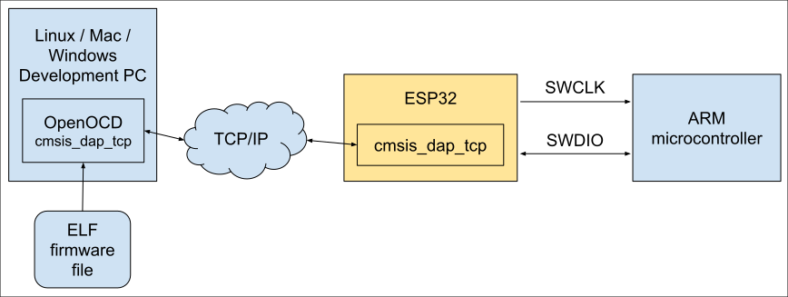
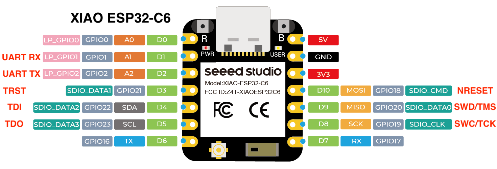
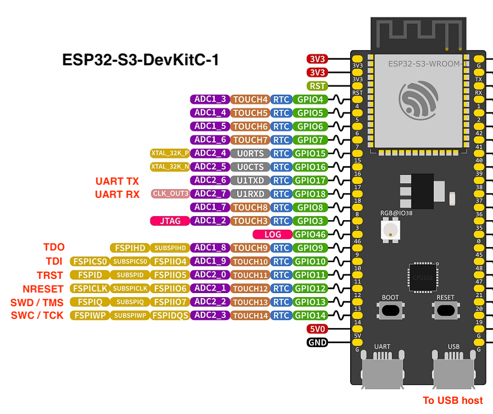
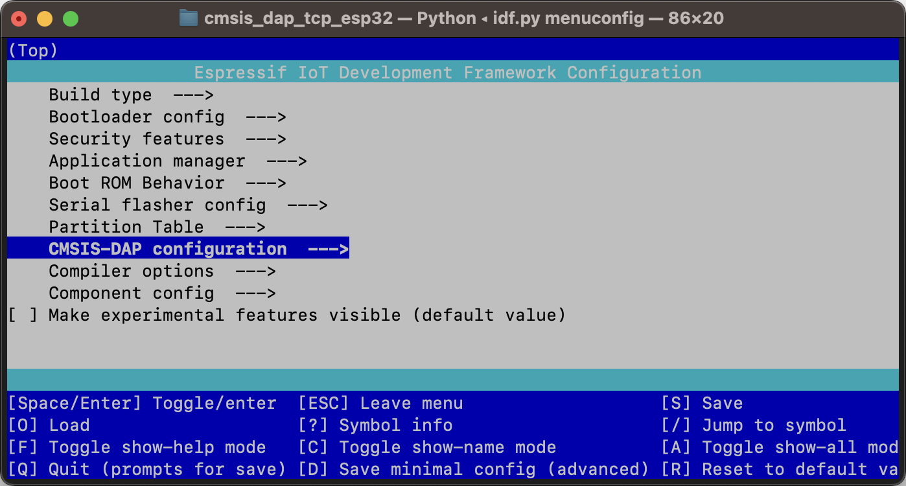
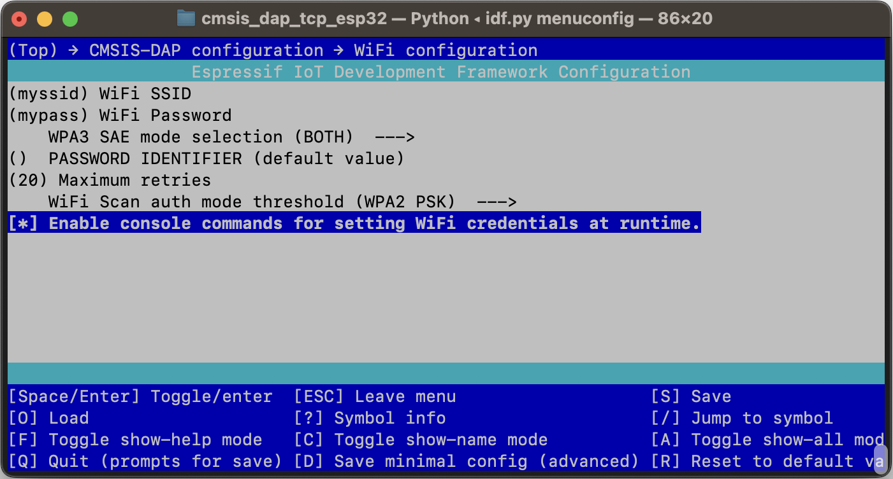
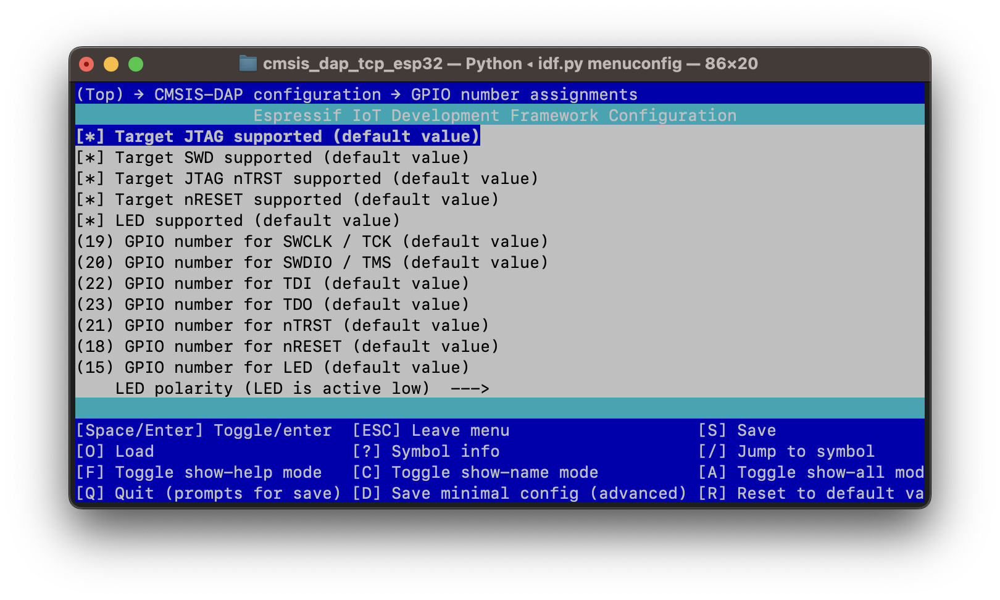
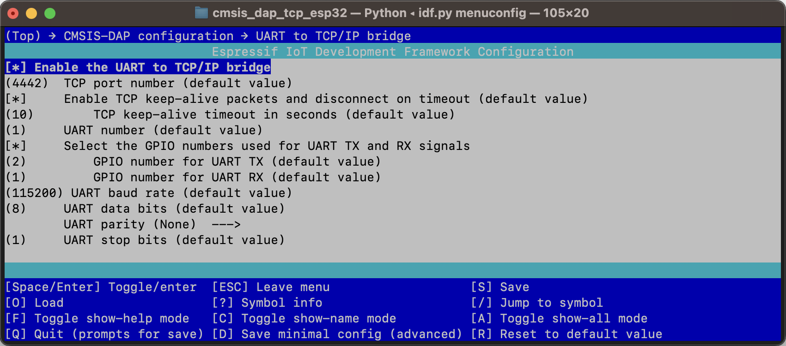
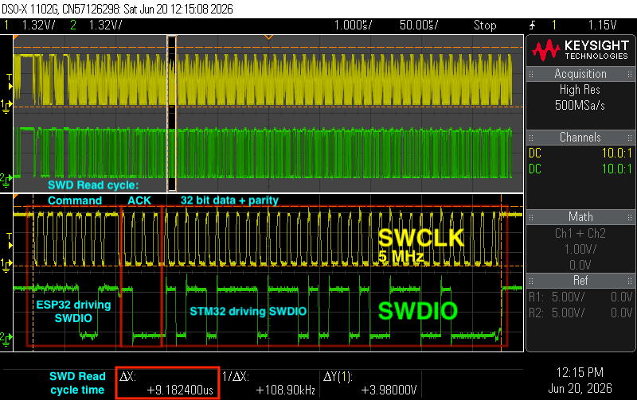
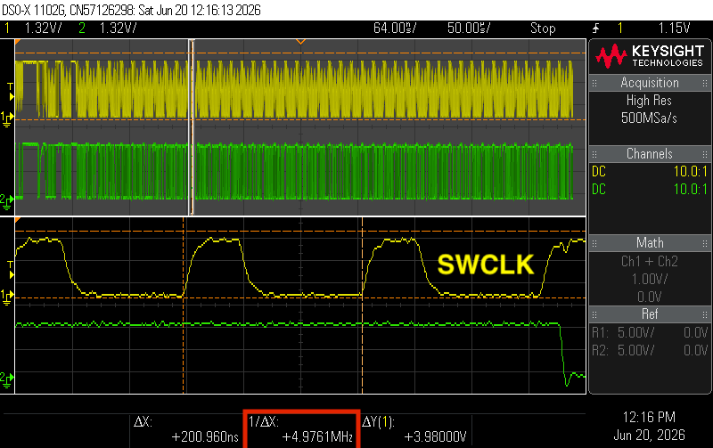
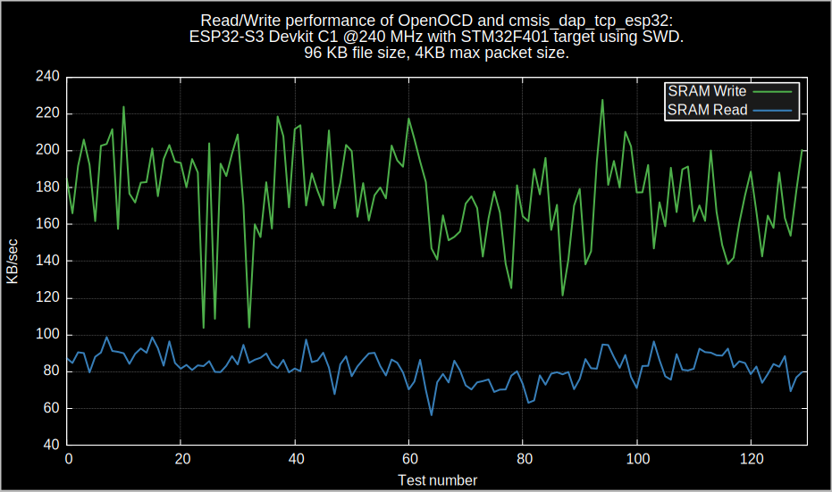

# cmsis_dap_tcp for OpenOCD

OpenOCD supports the CMSIS-DAP protocol to communicate with a JTAG / SWD
programmer. Typically this is a local programmer with a USB connection. With
the addition of the OpenOCD cmsis_dap_tcp backend, the CMSIS-DAP protocol can
now run over TCP/IP instead of USB. This allows OpenOCD to connect to a remote
programmer over the network.

This project provides the remote-side implementation of the cmsis_dap_tcp
protocol, using an ESP32 as the remote programmer. It allows a cheap ESP32
board to program and debug an ARM microcontroller target. Both JTAG and the
two-wire SWD interface are supported. OpenOCD connects to the ESP32 using
TCP/IP over WiFi, allowing remote flashing and debugging of the target
board.



- Tested with the XIAO ESP32C6 and ESP32-S3-DevKitC-1 development boards as the
  programmer, and STM32F103 Blue Pill and Nucleo STM32F401RE as the targets.
  A Lattice FPGA target has also been successfully used.
- Either JTAG mode or SWD mode can be used to program the target. 2 GPIO are
  needed for SWD, or a minimum of 4 GPIO for JTAG.
- An optional GPIO pin can be used to drive the NRST# (SRST) signal, but this
  is typically not required.
- In JTAG mode, an optional GPIO pin can be used to drive the TRST signal, but
  this is typically not required.
- A separate GPIO can drive an activity LED controlled by OpenOCD (standard or
  RGB LED).
- UART to TCP/IP bridge can be enabled to provide access to the target board's
  serial console remotely, using an ESP32 UART.
- Typical performance:
  - Reading / writing SRAM: up to 200 KB/sec
  - Flashing a 512 KB firmware image to the STM32F401RE
  completes in about 13.4 seconds, including erase, program, and verify (with 4
  to 8 seconds of that time used for flash erasure). The Blue Pill takes about
  6 seconds for a 64KB image.
  - Performance depends on the quality of your WiFi network.





The CMSIS-DAP code came from the Firmware directory of the [CMSIS-DAP
repo](https://github.com/ARM-software/CMSIS-DAP). ```DAP_config.h``` was then
modified to support the ESP32 GPIO.
```
commit 1fd47bed772ea40923472c90dfe11516e76033ee (HEAD -> main, tag: v2.1.2, origin/main, origin/HEAD)
```

# Limitations

The software has some limitations:

- SWO is currently unsupported.
- Maximum clock rate is about 1000 KHz (ESP32C6 configured for 160 MHz / 80 MHz).

# Building and Flashing the Firmware

This code requires the ESP-IDF build tools. Refer to the official
[installation guide](https://docs.espressif.com/projects/esp-idf/en/stable/esp32/get-started/index.html#installation)
and install them first. This project was tested using ESP-IDF v6.0.2.

Activate your ESP-IDF virtual environment:

```
. $HOME/esp/esp-idf/export.sh
```

The code supports different boards as 'presets'. They are described by the
CMakePresets.json file. Multiple board builds can coexist without interference
as each one uses its own build directory. To see the list of supported boards:

```
cmake --list-presets

Available configure presets:

  "board_esp32s3_devkit_c1" - Espressif ESP32-S3 Devkit C1 board
  "board_yd_esp32_s3"       - VCC-GND Studio YD-ESP32-S3 (Devkit C1 clone)
  "board_esp32s3_zero"      - Waveshare ESP32-S3-Zero board
  "board_xiao_esp32c6"      - Xiao ESP32-C6 board
  "board_xiao_esp32c6_alt"  - Xiao ESP32-C6 board (alternate pins for UART bridge)
```

If you are using one of the supported boards, type <b>one</b> of the following
lines, and all subsequent ```idf.py``` commands will target that specific
build.

```
export IDF_PRESET=board_esp32s3_devkit_c1
export IDF_PRESET=board_yd_esp32_s3
export IDF_PRESET=board_esp32s3_zero
export IDF_PRESET=board_xiao_esp32c6
export IDF_PRESET=board_xiao_esp32c6_alt
```

Then proceed with the build and installation:

```
idf.py fullclean menuconfig build flash
```

In menuconfig, goto to the "CMSIS-DAP configuration" page.

* Hardcoded WiFi credentials can be configured on the "WiFi configuration"
  subpage.  (If you are not using WPA2, you might need to adjust the WiFi Scan
  auth mode threshold).

* There is an option to allow runtime configuration of the WiFi credentials
  using the USB serial console, and these will be stored in flash memory.

  
  <br><br>
  

* If needed, you can change the GPIO port pins for JTAG, SWD, reset, and LED on
  the "GPIO number assignments" subpage. The signals can be disabled if they
  are not needed.

  

* If you want to use the UART to TCP/IP bridge, it can be configured on the
  the "UART to TCP/IP bridge" subpage. (Currently, the baud rate and other
  settings cannot be changed at runtime). A script ```host/uart_bridge.sh```
  is provided that uses ```socat``` to present the remote UART as a pseudo-tty
  that can be opened using any serial terminal program on the host. The UART
  bridge uses UART1 by default.

  

* The console uses the native USB-Serial port. This port is non-blocking when
  no USB host is connected (with ESP-IDF v5.1+), so the device operates
  normally without a USB host attached.  UART0 is unused. If you want to use
  UART0 for console instead, update the console settings in menuconfig and
  assign the UART bridge to GPIO pins that do not conflict with the UART0
  pins.

   ```
   Component config → ESP System Settings → Channel for console output → Default UART
   Component config → ESP System Settings → Channel for console secondary output → No secondary
   Component config → UART Bridge → Select GPIO numbers → enabled
   Component config → UART Bridge → UART TX → (choose an available GPIO)
   Component config → UART Bridge → UART RX → (choose an available GPIO)
   ```

If you want to support multiple independent JTAG/SWD interfaces, or use this
code as component in another application see [this
section](#multiple-interfaces--usage-as-a-component) below.

If you experience problems, additional debugging messages can be enabled by
editing ```main/cmsis_dap_tcp.h``` and uncommenting the following line. This
will impact performance.

```
#define DEBUG_PRINTING
```

# Running the Firmware

If you like, you can run the serial monitor to view and control the console. To
exit the serial monitor use ```Ctrl+]```.

```
idf.py monitor
```

Show the available console commands.

```
esp32> help
Available commands:
  help - Show this help message.
  wifi "<ssid>" "<password>" [auth_mode] - Configure WiFi credentials.
  reboot - Restart the device.
  status - Report network status.
esp32>
```

## Connecting to WiFi

After booting, the ESP32 will attempt to connect to WiFi. By default it will
use the hardcoded credentials provided in menuconfig. Optionally, you can
change these credentials at runtime using the command interface on the USB
serial console. To do this, use the ```wifi``` command and reboot afterwards:

```
esp32> wifi "my ssid" "my password" wpa2
esp32> reboot
```

To undo this and revert back to the hardcoded credentials, use empty strings:

```
esp32> wifi "" ""
esp32> reboot
```

After the ESP32 has connected to WiFi and obtained an IP address by DHCP you
can then run OpenOCD. The ESP32 will print status and error messages to the
console, including the WiFi connection status and IP address. A message is
printed whenever the OpenOCD client connects or disconnects. (Only one active
client is allowed).

You should see something like this from the ESP32:

```
CMSIS-DAP TCP running on ESP32
ESP-IDF version: v6.0-dev-1489-g4e036983a7
Hardware version: esp32s3 with 2 CPU core(s), WiFi/BLE, silicon revision v0.2, 2MB external flash
Minimum free heap size: 337312 bytes
MAC address: E4B323B60EB4
Enabling console commands.
Type 'help' to get the list of commands.
Use UP/DOWN arrows to navigate through command history.
Press TAB when typing command name to auto-complete.
Using WiFi credentials from flash.
Attempting to connect to WiFi SSID: 'SomeWifiRouter'
Connected to WiFi SSID: 'SomeWifiRouter'. RSSI: -75 dBm
IP address: 192.168.1.107
Disabling WiFi power savings to improve performance.
cmsis_dap_tcp: listening on port 4441.
UART bridge: remapping UART_TX = GPIO_NUM_16, UART_RX = GPIO_NUM_15.
UART bridge: listening on port 4442 for UART1.
IPv6 address (link-local): fe80:0000:0000:0000:9aa3:16ff:feec:6640
IPv6 address (global): 2406:3400:031f:ba10:9aa3:16ff:feec:6640
```

You can check the network status at any time by using the status command:

```
esp32> status
Connected to WiFi SSID: 'SomeWifiRouter'. RSSI: -61 dBm
IP address: 192.168.1.107
IPv6 address (link-local): fe80:0000:0000:0000:9aa3:16ff:feec:6640
IPv6 address (global): 2406:3400:031f:ba10:9aa3:16ff:feec:6640
cmsis_dap_tcp: listening on port 4441.
UART bridge: listening on port 4442.
```

# Building and Running OpenOCD

Get the latest source code from git. Configure and build it as usual:

```
git clone git://git.code.sf.net/p/openocd/code openocd
cd openocd
./bootstrap
./configure
make
```

An OpenOCD configuration file has been provided for convenience.
Edit your ```tcl/interface/cmsis-dap-tcp.cfg``` configuration file to point to
your ESP32's IP address:

```
adapter driver cmsis-dap
cmsis-dap backend tcp
cmsis-dap tcp host 192.168.1.107
cmsis-dap tcp port 4441
transport select swd
adapter speed 2000
reset_config none
```

If you are on a slow network, you might need to add this line to avoid short
timeouts that can lead to command mismatch errors in some cases. If so, specify
a longer timeout in milliseconds:

```
cmsis-dap tcp min_timeout 300
```

To flash an STM32 target, for example, run the following command from your
OpenOCD build directory.  Replace ```firmware.elf``` with the name of your
ELF file, and ```stm32f1x.cfg``` with the appropriate file for your
microcontroller.

```
./src/openocd --search tcl \
              -f tcl/interface/cmsis-dap-tcp.cfg \
              -f tcl/target/stm32f1x.cfg \
              -c "program firmware.elf verify reset exit"
```

To read/write SRAM, for example:

```
dd if=/dev/random of=random_96kb.bin bs=1024 count=96

./src/openocd --search tcl \
              -f tcl/interface/cmsis-dap-tcp.cfg \
              -f tcl/target/stm32f1x.cfg \
              -c "adapter speed 5000" \
              -c "init; halt; reset; poll off" \
              -c "load_image random_96kb.bin 0x20000000" \
              -c "dump_image /dev/null 0x20000000 0x18000" \
              -c "shutdown"
```

The LED normally illuminates whenever OpenOCD is connected to the ESP32. If you
want to control it manually or from scripts, you can use this OpenOCD command
to turn it off / on:

```
# cmsis-dap cmd <Command_ID 0x01> <LED_Selection> <LED_State>
cmsis-dap cmd 0x01 0x00 0x00
cmsis-dap cmd 0x01 0x00 0x01
```

Once everything is working you may disconnect the ESP32 from your PC and run
it as a standalone device. It can be powered by a USB charger. This could be
your normal use case, where the ESP32 is directly connected to a remote target,
and all debugging and flash programming is done over the network.

# Performance

On the ESP32-S3 @ 240MHz, a single SWD 32-bit transfer completes in less than
10 microseconds, with a maximum SWCLK clock rate of 5 MHz. The SWCLK duty cycle
is not 50% and it may vary slightly from one transfer to the next. An SWD
read cycle is pictured below. Yellow is SWCLK. Green is SWDIO.

<br>



<br>



Actual performance will depend on your WiFi network. For slow networks,
you might need to increase the ```cmsis-dap tcp min_timeout``` parameter if
you see error messages related to command mismatch.

Starting the OpenOCD server like this:

```
./src/openocd \
    --search tcl \
    -c "debug_level 2" \
    -c "adapter driver cmsis-dap" \
    -c "transport select swd" \
    -c "cmsis-dap backend tcp" \
    -c "cmsis-dap tcp host 192.168.1.107" \
    -c "cmsis-dap tcp port 4441" \
    -c "cmsis-dap tcp min_timeout 150" \
    -f "tcl/target/stm32f4x.cfg" \
    -c "reset_config none"

Open On-Chip Debugger 0.12.0+dev-01114-gbf01f1089 (2025-08-07-11:52)
Licensed under GNU GPL v2
For bug reports, read
	http://openocd.org/doc/doxygen/bugs.html
Info : CMSIS-DAP: using minimum timeout of 100 ms for TCP packets.
none separate
Info : Listening on port 6666 for tcl connections
Info : Listening on port 4444 for telnet connections
Info : CMSIS-DAP: Connecting to 192.168.1.107:4441 using TCP backend
Info : CMSIS-DAP: SWD supported
Info : CMSIS-DAP: JTAG supported
Info : CMSIS-DAP: Atomic commands supported
Info : CMSIS-DAP: Test domain timer supported
Info : CMSIS-DAP: FW Version = 2.1.2
Info : CMSIS-DAP: Serial# = E4B323B60EB4
Info : CMSIS-DAP: Interface Initialised (SWD)
Info : SWCLK/TCK = 0 SWDIO/TMS = 0 TDI = 0 TDO = 0 nTRST = 0 nRESET = 1
Info : CMSIS-DAP: Interface ready
Info : clock speed 2000 kHz
Info : SWD DPIDR 0x2ba01477
Info : [stm32f4x.cpu] Cortex-M4 r0p1 processor detected
Info : [stm32f4x.cpu] target has 6 breakpoints, 4 watchpoints
Info : [stm32f4x.cpu] Examination succeed
Info : [stm32f4x.cpu] starting gdb server on 3333
Info : Listening on port 3333 for gdb connections
Info : accepting 'telnet' connection on tcp/4444
```

## Using ESP32-C6 @ 160 MHz

Xiao ESP32C6 running at 160 MHz is the programmer board. Connecting to an
STM32F401RE target and reading and writing SRAM:

```
% telnet localhost 4444
> poll off

> load_image ./random_96kb.bin 0x20000000
98304 bytes written at address 0x20000000
downloaded 98304 bytes in 1.092678s (87.858 KiB/s)

> dump_image /dev/null 0x20000000 0x18000
dumped 98304 bytes in 1.469766s (65.317 KiB/s)
```

Programming and verifying a 512 KB flash image takes about 20 seconds:

```
time ./src/openocd \
    --search tcl \
    -c "debug_level 2" \
    -c "adapter driver cmsis-dap" \
    -c "transport select swd" \
    -c "cmsis-dap backend tcp" \
    -c "cmsis-dap tcp host 192.168.1.107" \
    -c "cmsis-dap tcp port 4441" \
    -f "tcl/target/stm32f4x.cfg" \
    -c "reset_config none" \
    -c "program ${ELF} verify reset exit"

Open On-Chip Debugger 0.12.0+dev-01114-gbf01f1089 (2025-08-07-11:52)
Licensed under GNU GPL v2
For bug reports, read
	http://openocd.org/doc/doxygen/bugs.html
none separate
Info : CMSIS-DAP: Connecting to 192.168.1.107:4441 using TCP backend
Info : CMSIS-DAP: SWD supported
Info : CMSIS-DAP: JTAG supported
Info : CMSIS-DAP: Atomic commands supported
Info : CMSIS-DAP: Test domain timer supported
Info : CMSIS-DAP: FW Version = 2.1.2
Info : CMSIS-DAP: Serial# = E4B323B60EB4
Info : CMSIS-DAP: Interface Initialised (SWD)
Info : SWCLK/TCK = 0 SWDIO/TMS = 0 TDI = 0 TDO = 0 nTRST = 0 nRESET = 1
Info : CMSIS-DAP: Interface ready
Info : clock speed 2000 kHz
Info : SWD DPIDR 0x2ba01477
Info : [stm32f4x.cpu] Cortex-M4 r0p1 processor detected
Info : [stm32f4x.cpu] target has 6 breakpoints, 4 watchpoints
Info : [stm32f4x.cpu] Examination succeed
Info : [stm32f4x.cpu] starting gdb server on 3333
Info : Listening on port 3333 for gdb connections
[stm32f4x.cpu] halted due to debug-request, current mode: Thread
xPSR: 0x01000000 pc: 0x08000734 msp: 0x20018000
** Programming Started **
Info : device id = 0x10016433
Info : flash size = 512 KiB
** Programming Finished **
** Verify Started **
** Verified OK **
** Resetting Target **
shutdown command invoked

real    0m19.242s
user    0m0.052s
sys     0m0.155s
```

## Using ESP32-S3 @ 240 MHz

Performance is higher on ESP32-S3. The throughput seems more variable
on each run, but here are some representative numbers for writing and
reading SRAM:

```
% telnet localhost 4444
> poll off

> load_image ./random_96kb.bin 0x20000000
98304 bytes written at address 0x20000000
downloaded 98304 bytes in 0.489488s (196.123 KiB/s)

> dump_image /dev/null 0x20000000 0x18000
dumped 98304 bytes in 0.832846s (115.267 KiB/s)
```

<br>




# Multiple interfaces / usage as a component

Two additional features were added by [@w531t4](https://github.com/w531t4).
Thank you!  These currently live on the ```w531t4-feat/multi_instance_safe```
branch and will be merged to main after further testing is completed:

1) This cmsis_dap_tcp server may be incorporated as a component in another
application.  Simply define your CMAKE_PROJECT_NAME as something other than
“cmsis_dap_tcp_esp32”.  This will cause ```main.c``` to be left out of the
project.  Replace the functionality of main.c with your own implementation.  Be
sure to call ```cmsis_dap_tcp_start(NULL, "cmsis_dap_tcp_task", …);```

2) A single ESP32 can now support multiple independent JTAG/SWD and UART
interfaces. Each one has its own GPIO pins and TCP port. This can be useful you
have multiple CPUs, MCUs, FPGAs on a board with separate JTAG chains. To do
this, use feature #1 above and call ```cmsis_dap_tcp_start()``` once for each
interface.  Pass a valid ```cmsis_dap_tcp_config``` parameter to define the
GPIO pin configuration for each interface.  If you’re using the UART bridge,
start the uart_bridge_tasks by passing a ```uart_bridge_config``` parameter for
each interface.  These parameters will override the menuconfig settings.
