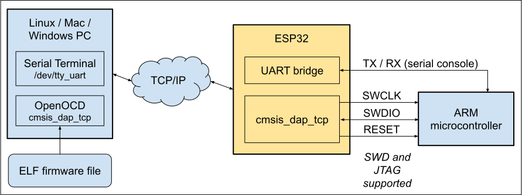

## cmsis_dap_tcp for OpenOCD

OpenOCD supports the CMSIS-DAP protocol to communicate with a JTAG / SWD
programmer. Typically this is a local programmer with a USB connection. With
the addition of the OpenOCD cmsis_dap_tcp backend, the CMSIS-DAP protocol can
now run over TCP/IP instead of USB. This allows OpenOCD to connect to a remote
programmer over the network.

This project provides the a remote-side implementation of the cmsis_dap_tcp
protocol, using an ESP32 as the remote programmer. It allows a cheap ESP32
board to program and debug an ARM microcontroller target. Both JTAG and the
two-wire SWD interface are supported. OpenOCD connects to the ESP32 using
TCP/IP over WiFi, allowing remote flashing and debugging of the ARM target
board.



- Tested with the XIAO ESP32C6 development board as the programmer, and
  STM32F103 Blue Pill and Nucleo STM32F401RE as the targets.
- Either JTAG mode or SWD mode can be used to program the target. 2 GPIO are
  needed for SWD, or a minimum of 4 GPIO for JTAG.
- An optional GPIO pin can be used to drive the NRST# (SRST) signal, but this
  is typically not required.
- In JTAG mode, an optional GPIO pin can be used to drive the TRST signal, but
  this is typically not required.
- A separate GPIO may be used to control an activity LED.
- Typical performance: flashing a 512 KB firmware image to the STM32F401RE
  completes in about 13.4 seconds, including erase, program, and verify (with 4
  to 8 seconds of that time used for flash erasure). The Blue Pill takes about
  6 seconds for a 64KB image. Performance also depends on the quality of your
  WiFi network.


The CMSIS-DAP code came from the Firmware directory of the [CMSIS-DAP
repo](https://github.com/ARM-software/CMSIS-DAP). ```DAP_config.h``` was then
modified to support the ESP32 GPIO.
```
commit 1fd47bed772ea40923472c90dfe11516e76033ee (HEAD -> main, tag: v2.1.2, origin/main, origin/HEAD)
```

## Limitations

The software has some limitations:

- CMSIS-DAP UART and SWO are currently unsupported.
- Maximum clock rate is 1000 KHz (when ESP32 configured for 160 MHz / 80 MHz).
- The WiFi credentials are hardcoded. The software must be rebuilt if you want
  to change them.

To configure your WiFi SSID and password, copy the
```wifi_password_example.h``` file to ```wifi_password.h``` and edit it
appropriately. For privacy, do not commit this file.

## Building

The [Arduino-Timer library](https://github.com/contrem/arduino-timer) is
a required prerequisite. Use the Arduino library manager to install it first.
(Currently it is only used for monitoring the WiFi status).

This build was tested with Arduino IDE v1.8.13, using the following settings:

- Board: Adafruit Feather ESP32-C6
- CPU Frequency: 160 MHz (Wifi)
- Flash Frequency: 80 MHz
- Flash mode: QIO
- Partition scheme: Default 4MB with SPIFFS (1.2MB APP / 1.5MB SPIFFS)
- Core debug level: None
- Erase all flash before sketch upload: Enabled
- JTAG adapter: Integrated USB JTAG

Flash it onto the ESP32 using USB. This project doesn't currently support OTA
updates, but this feature can be added if necessary.

## Building / Running OpenOCD

The cmsis_dap_tcp driver is committed to the OpenOCD Gerrit repo, change number
8973. Refer to the [source code](https://review.openocd.org/c/openocd/+/8973).
Until this change is merged into the main branch of OpenOCD, get it like this:

```
git clone git://git.code.sf.net/p/openocd/code openocd
cd openocd
git fetch https://review.openocd.org/openocd refs/changes/73/8973/9
git checkout FETCH_HEAD
```

You should see:

```
HEAD is now at d91d79d7e jtag/drivers/cmsis_dap: add new backend cmsis_dap_tcp
```

Configure and build OpenOCD as usual, while enabling the cmsis_dap_tcp driver:

```
./configure --enable-cmsis-dap-tcp
```

An OpenOCD configuration file has been provided for convenience.
Update your ```tcl/interface/cmsis_dap_tcp.cfg``` configuration file to point to
your ESP32's IP address:

```
adapter driver cmsis-dap
cmsis-dap backend tcp
cmsis-dap tcp host 192.168.1.4
cmsis-dap tcp port 4441
transport select swd
reset_config none
```

To flash an STM32 target, run the following command from your OpenOCD build
directory.  Replace ```firmware.elf``` with the name of your ELF file, and
```stm32f1x.cfg``` with the appropriate file for your microcontroller.

```
./src/openocd --search tcl \
              -f tcl/interface/cmsis-dap-tcp.cfg \
              -f tcl/target/stm32f1x.cfg \
              -c "program firmware.elf verify reset exit"
```

## Operation

After power-on, the ESP32 will attempt to connect to the WiFi that was
configured in ```wifi_password.h``` It will then begin listing for an incoming
connection from OpenOCD. If the ESP32 is connected to a USB serial port, it
will print status and error messages to that port. A message is printed
whenever the OpenOCD client connects or disconnects. Only one active connection
is allowed.

```
ESP32 cmsis_dap_tcp booting (HW version 1.0, SW version 0x0100) ...
Attempting to connect to SSID 'SomeWifiRouter'
....
Connected to WiFi:
SSID:        SomeWifiRouter
RSSI:        -51 dBm
IP Address:  192.168.1.4
cmsis_dap_tcp server listening on port 4441.

Client connected.
Client disconnected.
```

Additional messages may be enabled by editing cmsis_dap_tcp.h and uncommenting
the following line. This will impact performance.
```
#define DEBUG_PRINTING
```

A single SWD 32-bit transfer completes in about 45 microseconds, with an
SWCLK clock rate of approximately 1 MHz. Yellow is SWCLK. Green is SWDIO.

(TODO: the scope available at the time to make these measurements was very
limited. Redo these measurements with a better scope).


